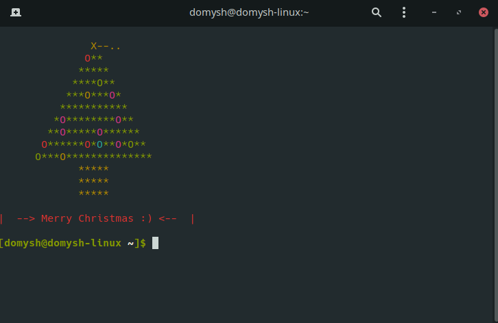

# Christmas Tree
## Merry Christmas :) !!!
 

 

### ALLERT! This script is activated by ChristmasMagic.event!

<b>ChristmasMagic.event</b> is active <b>from the 1st december to 30th december</b>. 
You can active this script only in these days....

### Make your terminal ready for Christmas!

Compile the program and call it in .bashrc
for have a christmas tree on your terminal!

